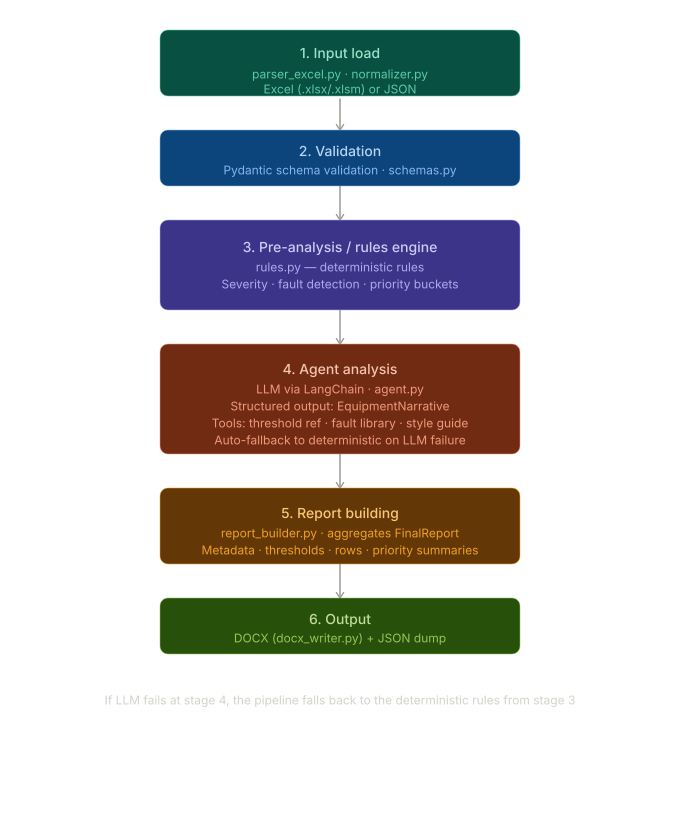

# Vibration Analysis Agent

AI-powered vibration analysis agent for rotating equipment condition monitoring. Parses raw Excel vibration measurement data, applies deterministic rules-based analysis (ISO 10816-3), then optionally uses an LLM agent to generate natural language analysis narratives, fault hypotheses, and actionable recommendations. Outputs a structured DOCX report and JSON.

---

## Table of Contents

- [Architecture](#architecture)
- [Project Structure](#project-structure)
- [Installation & Setup](#installation--setup)
- [Configuration](#configuration)
- [Usage](#usage)
- [Data Model](#data-model)
- [Rules Engine](#rules-engine)
- [Agent Mode](#agent-mode)
- [Excel Input Format](#excel-input-format)
- [Output](#output)
- [Dependencies](#dependencies)

---

## Architecture

The pipeline has 6 stages:



---

## Project Structure

```
agent-wilmar/
├── main.py                # CLI entry point with argparse
├── requirements.txt       # Python dependencies
├── .env                   # Environment variables (gitignored)
├── .gitignore
├── template.json          # JSON schema template describing parser output structure
├── template_parsed.json   # Example of actual parsed output
├── input/                 # Input Excel files (.xlsx, .xlsm)
│   └── template.xlsx
├── output/                # Generated reports
│   ├── report.docx
│   └── report.json
└── src/
    ├── __init__.py
    ├── config.py          # Settings dataclass loaded from env vars
    ├── schemas.py         # Pydantic models for all data structures
    ├── parser_excel.py    # Excel parser using openpyxl with column mapping
    ├── normalizer.py      # JSON loader & record extractor
    ├── rules.py           # Deterministic rules engine (thresholds, fault detection)
    ├── pipeline.py        # Pipeline orchestration — ties all stages together
    ├── agent.py           # LLM agent via LangChain + fallback logic
    ├── prompts.py         # System prompt & user prompt builder for the agent
    ├── tools.py           # LangChain tools (threshold ref, fault library, style guide)
    ├── report_builder.py  # FinalReport assembly from records + narratives
    └── docx_writer.py     # DOCX generation using python-docx
```

---

## Installation & Setup

```bash
# Clone the repository
git clone <repo-url>
cd agent-wilmar

# Create virtual environment
python -m venv .venv-agent
source .venv-agent/bin/activate   # Linux/macOS
# .venv-agent\Scripts\activate    # Windows

# Install dependencies
pip install -r requirements.txt

# Configure environment variables
cp .env.example .env
# Edit .env with your API keys (see Configuration section)
```

---

## Configuration

All configuration is managed through environment variables in `.env`.

### General

| Variable | Default | Description |
|----------|---------|-------------|
| `LLM_PROVIDER` | `openrouter` | LLM provider: `openrouter` or `sumopod` |
| `REPORT_TITLE` | `"Laporan Detail Analisa & Rekomendasi Vibrasi Rotating Equipment (Terkoreksi)"` | Report title |
| `FOCUS_LABEL` | `'Equipment dengan Status "Running"'` | Label for the report focus scope |

### OpenRouter Provider

| Variable | Default | Description |
|----------|---------|-------------|
| `OPENROUTER_API_KEY` | — | API key for OpenRouter |
| `OPENROUTER_MODEL` | `minimax/minimax-m2.5:free` | Model identifier |
| `OPENROUTER_TEMPERATURE` | `0.2` | Sampling temperature |
| `OPENROUTER_MAX_TOKENS` | `1800` | Maximum output tokens |
| `OPENROUTER_REASONING_EFFORT` | `low` | Reasoning effort level |
| `OPENROUTER_REASONING_SUMMARY` | `concise` | Reasoning summary mode |

### SumoPod Provider

| Variable | Default | Description |
|----------|---------|-------------|
| `SUMOPOD_API_KEY` | — | API key for SumoPod |
| `SUMOPOD_MODEL` | `glm-5.1` | Model identifier |
| `SUMOPOD_BASE_URL` | `https://ai.sumopod.com/v1` | API base URL |
| `SUMOPOD_TEMPERATURE` | `0.2` | Sampling temperature |
| `SUMOPOD_MAX_TOKENS` | `1800` | Maximum output tokens |

---

## Usage

### Agent Mode (LLM-powered analysis)

```bash
python main.py \
  --input input/template.xlsx \
  --output-docx output/report.docx \
  --output-json output/report.json \
  --mode agent
```

### Fallback Mode (deterministic only, no LLM required)

```bash
python main.py \
  --input input/template.xlsx \
  --output-docx output/report.docx \
  --output-json output/report.json \
  --mode fallback
```

### Using Pre-Parsed JSON Input

```bash
python main.py \
  --input template_parsed.json \
  --output-docx output/report.docx \
  --output-json output/report.json \
  --mode fallback
```

### CLI Arguments

| Argument | Required | Description |
|----------|----------|-------------|
| `--input` | Yes | Path to input file (.xlsx, .xlsm, or .json) |
| `--output-docx` | Yes | Path for the output DOCX report |
| `--output-json` | No | Path for the output JSON report |
| `--mode` | No | `agent` (default) or `fallback` |

---

## Data Model

### Severity Levels (ISO 10816-3)

Vibration velocity (mm/s RMS):

| Severity | Range | Meaning |
|----------|-------|---------|
| `BAIK` | < 2.8 | Good — normal operating condition |
| `CUKUP` | 2.8 — 4.5 | Fair — acceptable, requires trend monitoring |
| `WASPADA` | 4.5 — 7.1 | Alert — unsatisfactory, needs investigation |
| `BAHAYA` | > 7.1 | Danger — risk of damage, immediate action required |

Temperature (°C):

| Severity | Range |
|----------|-------|
| `BAIK` | < 60 |
| `CUKUP` | 60 — 80 |
| `BAHAYA` | > 80 |

### Fault Types

| Fault | Detection Signal |
|-------|-----------------|
| `bearing_damage` | High Enveloping (HE) values >= 4.5 |
| `misalignment` | High Axial (AX) values on 2+ points >= 4.5 |
| `unbalance` | High Horizontal (H) values on 2+ points >= 4.5 |
| `overheat_or_lubrication` | Temperature >= 60°C |

### Key Data Structures

**`ParsedEquipmentRecord`** — One row of equipment data from the parser:
- `tanggal` — Measurement date
- `no` — Equipment sequence number
- `area` — Location/area name
- `equipment` — Tag name, description, foundation type, orientation, kW, Ampere, RPM
- `status` — Operation status (`run`/`standby`/`repair`, exactly one true)
- `driver` — Motor bearing measurements (NDE & DE): ax, v, h, he, temp + grounding + terminal box temp
- `driven` — Driven equipment bearing measurements (DE & NDE): ax, v, h, he, temp

**`PreAnalysisFacts`** — Deterministic analysis results for one equipment:
- Top vibration point, metric, and value
- Overall severity level
- List of abnormal findings (`MetricFinding`)
- List of fault hypotheses with confidence scores and evidence

**`EquipmentNarrative`** — Agent/LLM output for one equipment:
- Analysis text (natural language)
- Recommendations (list of actionable strings)
- Priority bucket (`PRIORITAS_1` / `PRIORITAS_2` / `PRIORITAS_3`)

**`FinalReport`** — Complete report structure:
- `meta` — Title, date, area, focus label
- `standard_reference_intro` — ISO reference text
- `thresholds` — List of threshold descriptions
- `rows` — List of `ReportRow` (one per analyzed equipment)
- `priority_1_text`, `priority_2_text`, `priority_3_text` — Priority summaries
- `closing_note`

### Bearing Measurement Axes

| Key | Direction | Unit |
|-----|-----------|------|
| `ax` | Axial | mm/s RMS |
| `v` | Vertical | mm/s RMS |
| `h` | Horizontal | mm/s RMS |
| `he` | High-frequency Enveloping (bearing defect indicator) | mm/s RMS |
| `temp` | Bearing temperature | °C |

### Bearing Positions

- **DE** (Drive End) — Side connected to coupling/driven equipment
- **NDE** (Non-Drive End) — Side opposite the coupling

---

## Rules Engine

The deterministic rules engine (`src/rules.py`) performs analysis without requiring an LLM. It operates through these functions:

### Severity Classification

- `classify_vibration(value)` — Maps a vibration value to a `SeverityLabel` using ISO 10816-3 thresholds
- `classify_temperature(value)` — Maps a temperature value to a `SeverityLabel`

### Fault Detection

`detect_faults()` uses pattern matching on abnormal findings:

| Pattern | Confidence | Fault |
|---------|-----------|-------|
| HE >= 4.5 on any point | 0.75 (or 0.90 if any HE > 7.1) | `bearing_damage` |
| AX >= 4.5 on 2+ points | 0.75 (or 0.88 if 3+ points) | `misalignment` |
| H >= 4.5 on 2+ points | 0.70 | `unbalance` |
| Temp >= 60°C on any point | 0.65 | `overheat_or_lubrication` |

### Priority Assignment

`default_priority_bucket()` maps overall severity to action priority:

| Overall Level | Priority | Action |
|---------------|----------|--------|
| `BAHAYA` | `PRIORITAS_1` | Immediate action required |
| `WASPADA` | `PRIORITAS_2` | Schedule investigation and corrective maintenance |
| `CUKUP` / `BAIK` | `PRIORITAS_3` | Tighten monitoring |

### Fallback Analysis

When the LLM agent is unavailable or `--mode fallback` is used, `deterministic_analysis_text()` generates a structured analysis paragraph from the pre-analysis facts, and `default_recommendations()` provides fault-specific actionable recommendations.

---

## Agent Mode

When `--mode agent` is set, the pipeline uses an LLM to produce richer natural language analysis.

### How It Works

1. `build_chat_model()` creates a LangChain chat model based on the configured provider
2. A LangChain agent is created with 3 tools and a system prompt
3. The agent receives pre-computed facts as JSON and produces an `EquipmentNarrative`
4. Structured output ensures the response conforms to the Pydantic schema

### Available Tools

| Tool | Description |
|------|-------------|
| `get_threshold_reference` | Returns ISO 10816-3 severity thresholds for vibration and temperature |
| `get_fault_library` | Returns definition and default actions for a given fault name |
| `get_report_style_guide` | Returns the operational technical report writing style guide |

### Provider Setup

- **OpenRouter** — Set `LLM_PROVIDER=openrouter` and provide `OPENROUTER_API_KEY`. Supports reasoning models with configurable effort level.
- **SumoPod** — Set `LLM_PROVIDER=sumopod` and provide `SUMOPOD_API_KEY`. Uses an OpenAI-compatible API.

### Fallback Behavior

If the LLM call fails for any reason (API error, timeout, invalid response), the agent automatically falls back to deterministic mode and logs a warning:

```
[WARN] build_agent_narrative gagal, fallback dipakai: <error message>
```

---

## Excel Input Format

The parser expects an Excel workbook with the following column layout:

### Column Mapping

| Column | Field |
|--------|-------|
| 3 | `no` (sequence number) |
| 4 | `area` (location) |
| 5 | `equipment.tag_name` |
| 6 | `equipment.deskripsi` (description) |
| 7 | `equipment.pondasi` (foundation: Rigid/Flexible) |
| 8 | `equipment.posisi` (orientation: Horizontal/Vertikal) |
| 9 | `equipment.kw` (motor power, kW) |
| 10 | `equipment.ampere` (nominal current, A) |
| 11 | `equipment.rpm` (nominal speed, RPM) |
| 12 | `status.run` (marked with √) |
| 13 | `status.standby` (marked with √) |
| 14 | `status.repair` (marked with √) |
| 15–19 | `driver.NDE.{ax, v, h, he, temp}` |
| 20–24 | `driver.DE.{ax, v, h, he, temp}` |
| 25 | `driver.grounding` (resistance, Ohm) |
| 26 | `driver.temp_terminal_box` (°C) |
| 27–31 | `driven.DE.{ax, v, h, he, temp}` |
| 32–36 | `driven.NDE.{ax, v, h, he, temp}` |

### Parsing Rules

- Data rows start at row 12
- Rows without both tag name and description are skipped
- Date is extracted from cell D7 area (looking for a "Date" label) or falls back to the sheet title
- Status fields use the `√` checkmark character
- Numeric fields are parsed as `float`; non-numeric or empty cells become `None`
- Multiple sheets in one workbook are all parsed and concatenated

### JSON Input Format

Pre-parsed JSON input must be one of:
- A JSON array of record objects
- A JSON object with a `"records"` or `"items"` key containing an array

The schema template file (`template.json`) is NOT valid input — it describes the structure but is not actual measurement data.

---

## Output

### DOCX Report

Generated via `python-docx` with the following sections:

1. **Title** — Report title centered, with metadata (date, area, focus)
2. **Standard Reference** — ISO 10816-3 reference with threshold descriptions
3. **Analysis Table** — 6-column table:
   - No.
   - Tag Name
   - Deskripsi
   - Titik & Nilai Vibrasi Tertinggi (highest vibration point & value)
   - Analisa (analysis narrative)
   - Rekomendasi (recommendations)
4. **Priority Summary** — Three priority levels with equipment tag lists and action descriptions

Formatting: Arial font, landscape-friendly margins, styled table grid.

### JSON Report

Complete structured report matching the `FinalReport` schema. Contains all data from the DOCX in machine-readable form, suitable for integration with other systems.

---

## Dependencies

| Package | Version | Purpose |
|---------|---------|---------|
| `python-docx` | >=1.1.2 | DOCX report generation |
| `pydantic` | >=2.6.0 | Data validation and schema enforcement |
| `python-dotenv` | >=1.0.1 | Environment variable management from `.env` |
| `langchain` | >=1.0.0 | Agent framework for LLM orchestration |
| `langchain-openrouter` | >=0.1.0 | OpenRouter LLM provider integration |
| `langchain-openai` | >=0.1.0 | OpenAI-compatible API provider (for SumoPod) |
| `openpyxl` | >=3.1.2 | Excel file parsing |
